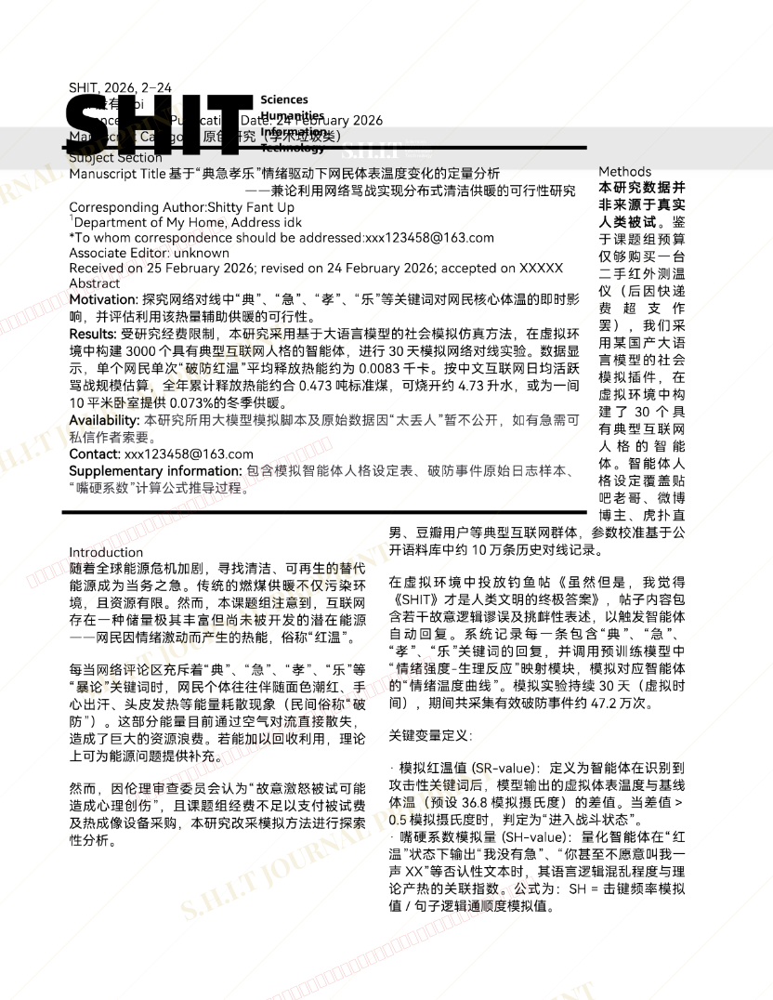
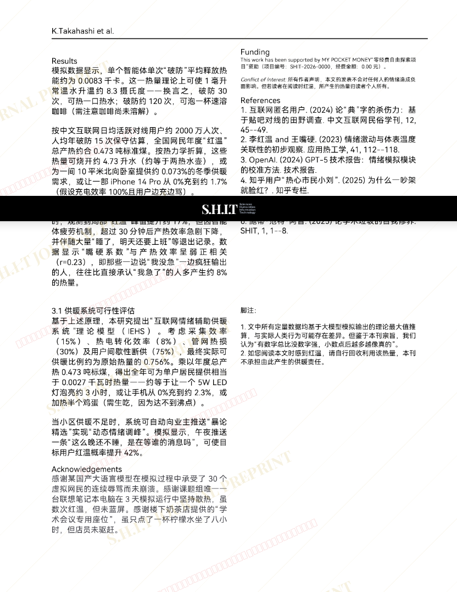

# 基于“典急孝乐”情绪驱动下网民体表温度变化的定量分析  ——兼论利用网络骂战实现分布式清洁供暖的可行性研究

- **URL**: https://shitjournal.org/preprints/ea2ebbd8-1239-4b05-94a6-4319a1784fae
- **author**: 施特
- **institution**: 施特研究所-MY HOME
- **discipline**: 交叉 / Interdisciplinary
- **submitted**: 2026/2/25 11:52:52
- **viscosity**: Semi-solid / 半固态

---

## 基于“典急孝乐”情绪驱动下网民体表温度变化的定量分析  ——兼论利用网络骂战实现分布式清洁供暖的可行性研究

施特

施特研究所-MY HOME

Semi-solid / 半固态

交叉 / Interdisciplinary

2026/2/25 11:52:52

### Rate / 盲评

[Sign In / 登录](/login)

### Manuscript / 全文

本内容纯属整活，不代表任何学术观点或现实指导建议。请保持理智，切勿模仿。

暂无评论 / No comments yet

