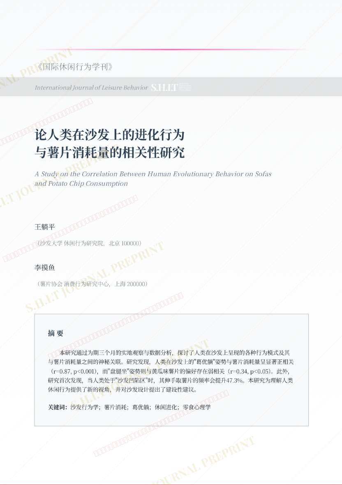
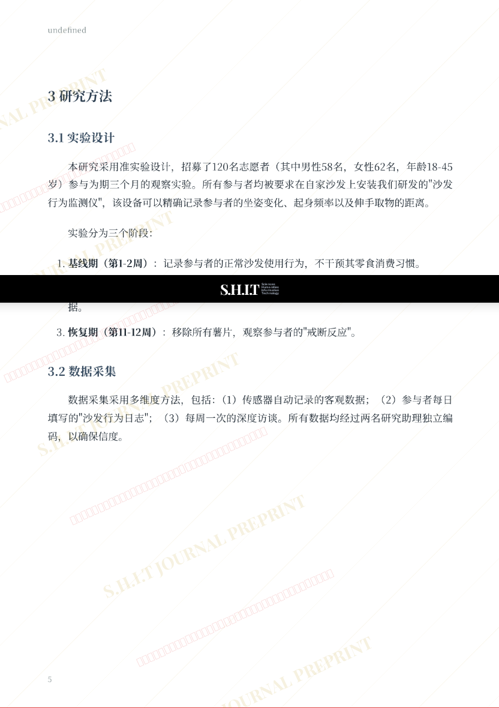
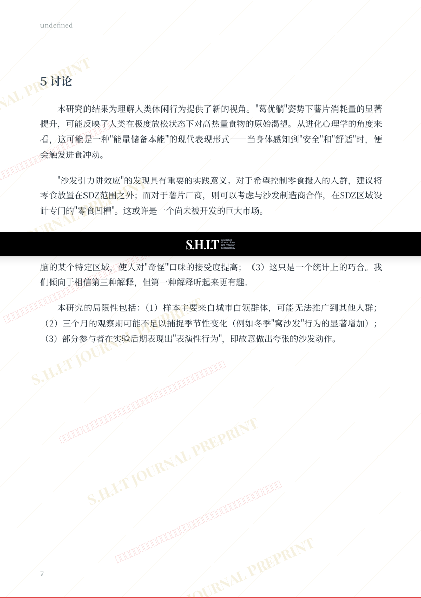

# 论人类在沙发上的进化行为与薯片消耗量的相关性研究

- **URL**: https://shitjournal.org/preprints/eb8afb42-f6fd-481e-99a9-b3f57cc27275
- **author**: 梦语awa
- **institution**: 清华附中郑州学校
- **discipline**: 交叉 / Interdisciplinary
- **submitted**: 2026/2/25 14:24:48
- **viscosity**: Semi-solid / 半固态

---

## 论人类在沙发上的进化行为与薯片消耗量的相关性研究

梦语awa

清华附中郑州学校

Semi-solid / 半固态

交叉 / Interdisciplinary

2026/2/25 14:24:48

bilibili:梦语awa

### Rate / 盲评

[Sign In / 登录](/login)

### Manuscript / 全文

本内容纯属整活，不代表任何学术观点或现实指导建议。请保持理智，切勿模仿。

暂无评论 / No comments yet

