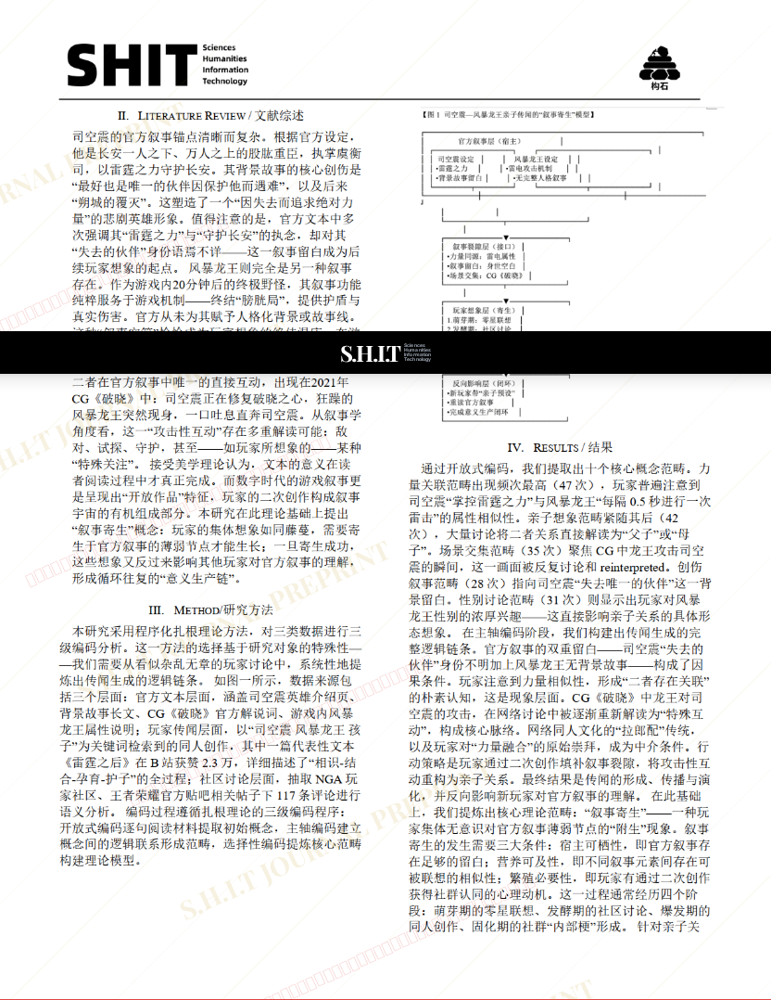
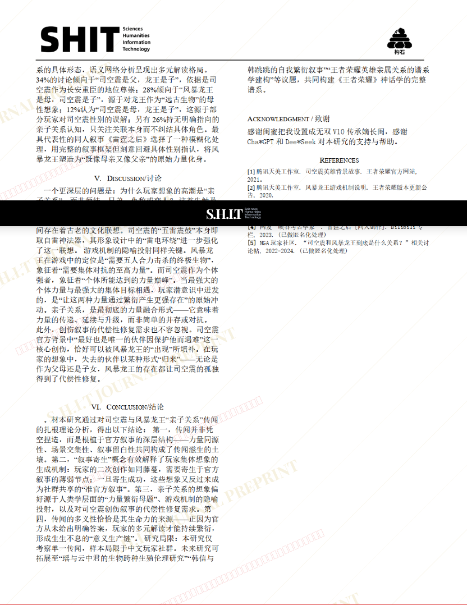

# 雷霆所孕，风暴所生：司空震与风暴龙王亲子关系的叙事考古学研究 ——基于扎根理论的王者荣耀玩家集体想象分析

## 元信息

- **作者**: 一川烟柳含风
- **机构**: 稷下学院
- **社交媒体**: 王者荣耀@一川烟柳含风
- **分区**: sediment
- **学科**: humanities
- **标签**: meme
- **提交时间**: 2026-03-03T19:04:48.885564Z
- **评分**: 3.49 / 5（90 人）

## 链接

- [网站原始文章](https://shitjournal.org/preprints/ebf14364-ae66-480d-a590-4a684132ee15)
- [PDF](https://files.shitjournal.org/ebf14364-ae66-480d-a590-4a684132ee15.pdf)
- [文章元信息](ebf14364-ae66-480d-a590-4a684132ee15.meta.json)

## 正文

