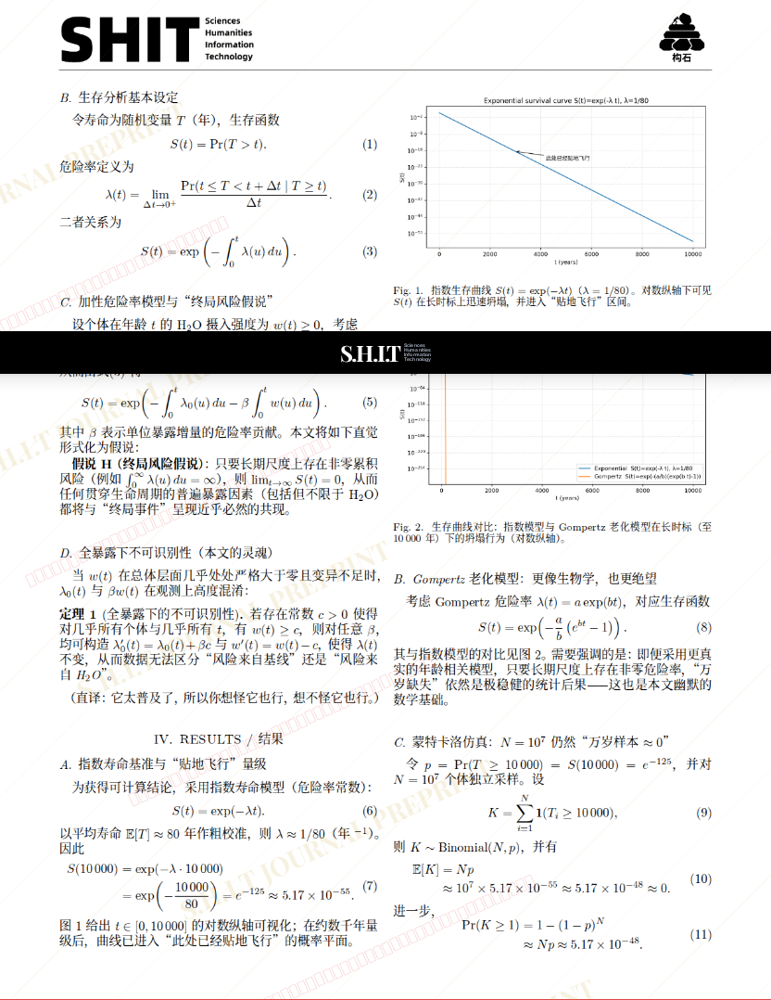
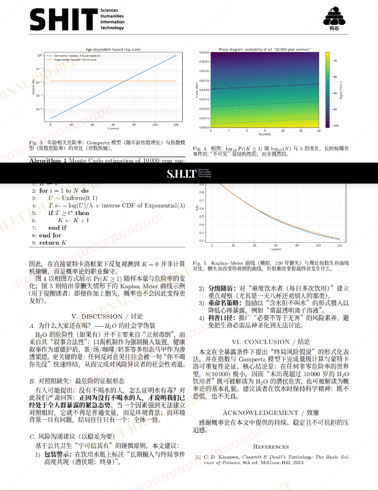

# 论 H2O 的终局风险假说：为何尚未观测到超过 10 000 岁的 H2O 饮用者——基于生存 建模、蒙特卡洛仿真与风险沟通的综合研究

- **URL**: https://shitjournal.org/preprints/edb0f92b-5bc3-43e5-adb9-a9b52ce88ff0
- **author**: 丰川翔
- **institution**: 木柜子乐队
- **discipline**: 交叉 / Interdisciplinary
- **submitted**: 2026/3/1 04:55:10
- **viscosity**: Stringy / 拉丝型

---

## 论 H2O 的终局风险假说：为何尚未观测到超过 10 000 岁的 H2O 饮用者——基于生存 建模、蒙特卡洛仿真与风险沟通的综合研究

丰川翔

木柜子乐队

Stringy / 拉丝型

交叉 / Interdisciplinary

2026/3/1 04:55:10

偷吃两组猪 · 安卓交通大学机长学院共一

### Rate / 盲评

[Sign In / 登录](/login)

### Manuscript / 全文

本内容纯属整活，不代表任何学术观点或现实指导建议。请保持理智，切勿模仿。

暂无评论 / No comments yet

