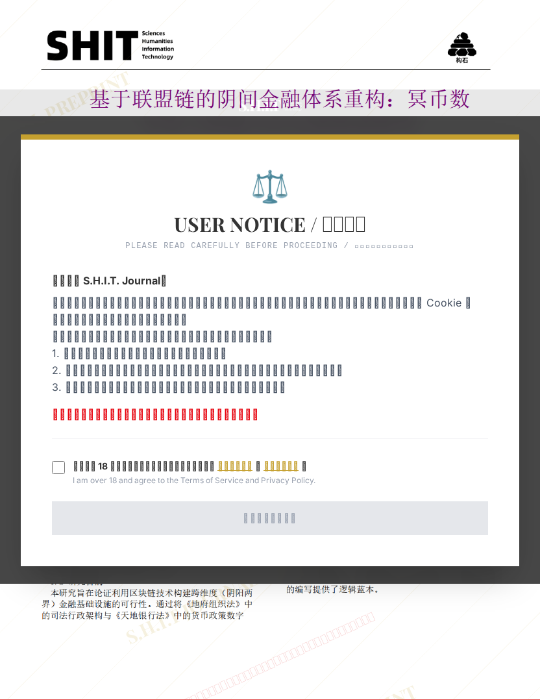

# 基于联盟链的阴间金融体系重构：冥币数字化与智能合约兑换机制研究

## 元信息

- **作者**: 洛雨竹
- **机构**: 
- **分区**: septic
- **学科**: law_social
- **标签**: meme
- **提交时间**: 2026-03-03T16:26:16.525314Z
- **评分**: 4.07 / 5（43 人）

## 链接

- [网站原始文章](https://shitjournal.org/preprints/f1a21081-dac4-4e0d-a2bf-ae2a4b0a4182)
- [PDF](https://files.shitjournal.org/f1a21081-dac4-4e0d-a2bf-ae2a4b0a4182.pdf)
- [文章元信息](f1a21081-dac4-4e0d-a2bf-ae2a4b0a4182.meta.json)

## 正文

