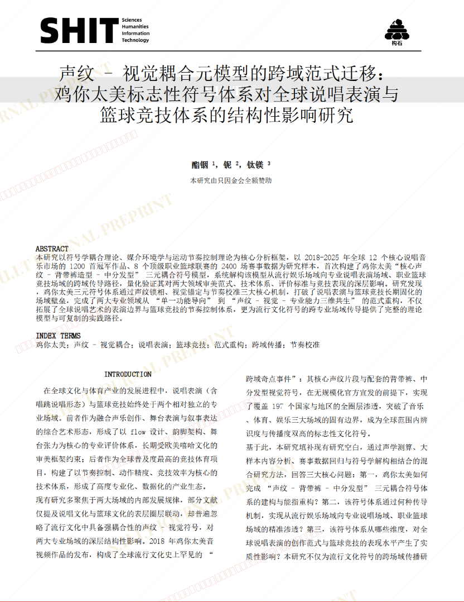
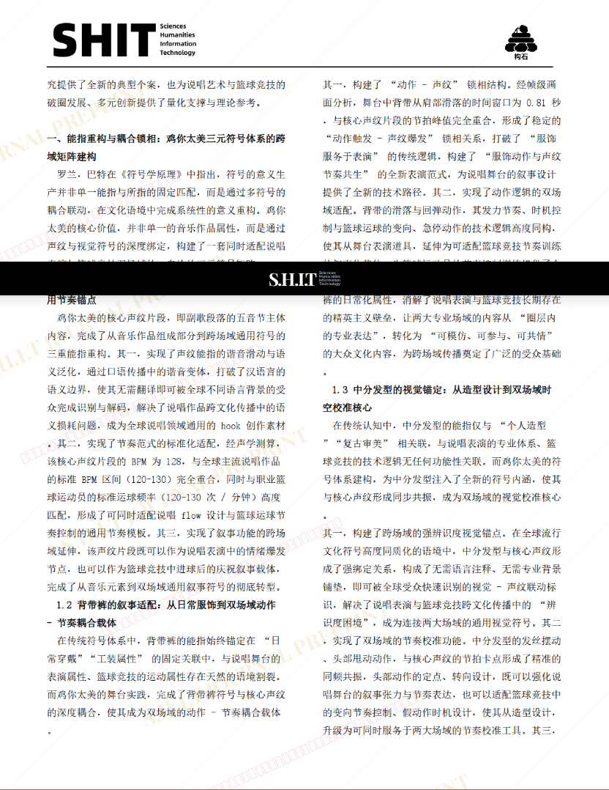
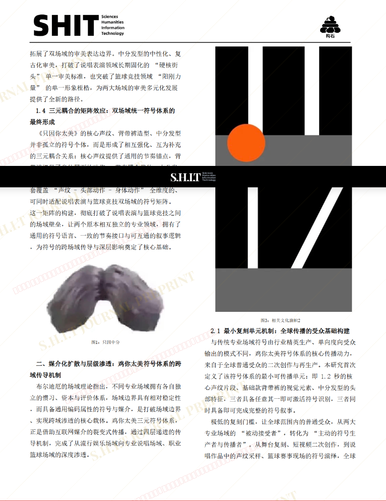
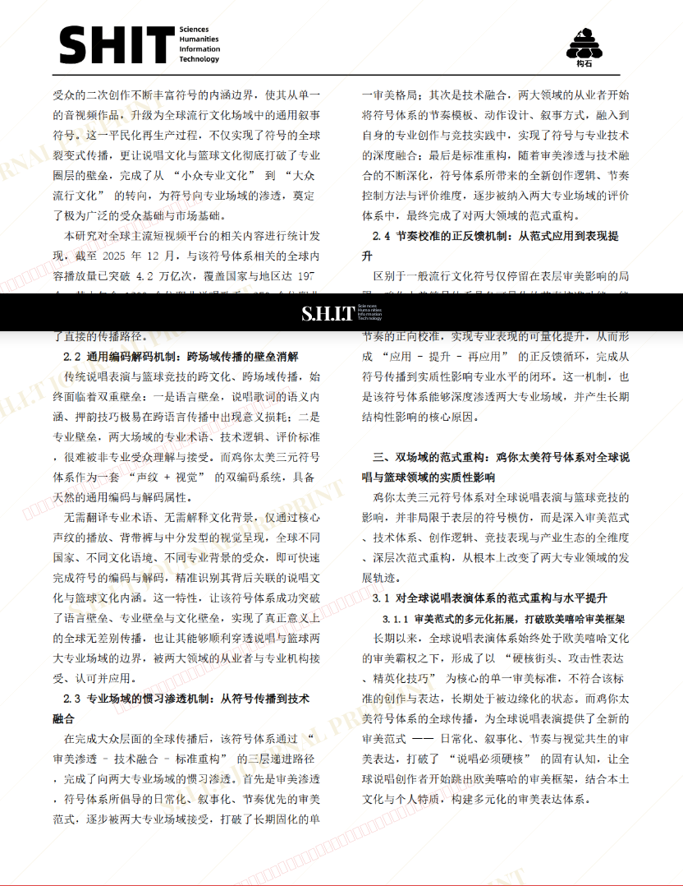
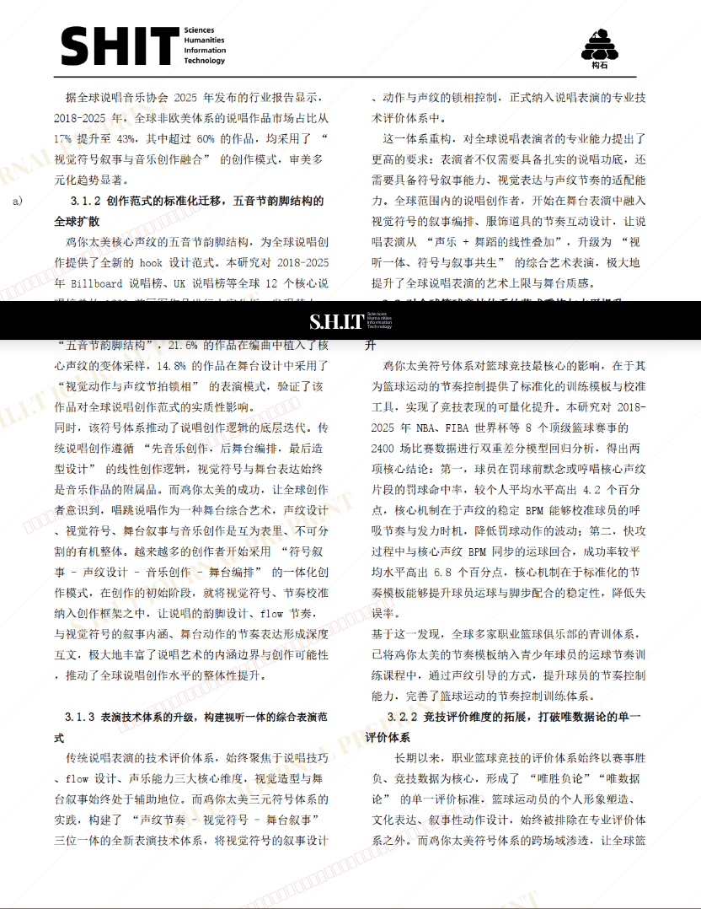
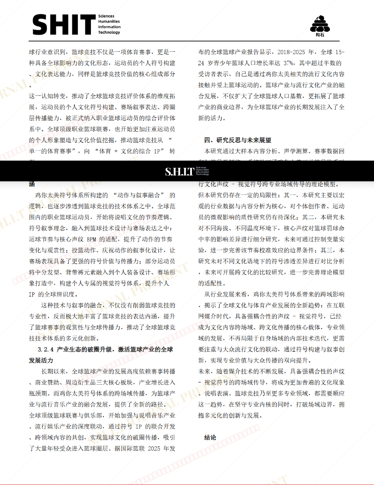
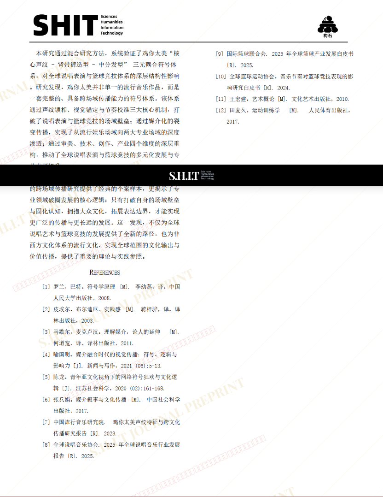

# 声纹 - 视觉耦合元模型的跨域范式迁移： 鸡你太美标志性符号体系对全球说唱表演与篮球竞技体系的结构性影响研究

- **URL**: https://shitjournal.org/preprints/f9b41419-cc2d-42dc-83cd-cc7358b7fc44
- **author**: 酯铟铌钛镁
- **institution**: 鸡尼大学
- **discipline**: 交叉 / Interdisciplinary
- **submitted**: 2026/2/28 08:45:37
- **viscosity**: Semi-solid / 半固态

---

## 声纹 - 视觉耦合元模型的跨域范式迁移： 鸡你太美标志性符号体系对全球说唱表演与篮球竞技体系的结构性影响研究

酯铟铌钛镁

鸡尼大学

Semi-solid / 半固态

交叉 / Interdisciplinary

2026/2/28 08:45:37

### Rate / 盲评

[Sign In / 登录](/login)

### Manuscript / 全文

本内容纯属整活，不代表任何学术观点或现实指导建议。请保持理智，切勿模仿。

暂无评论 / No comments yet

