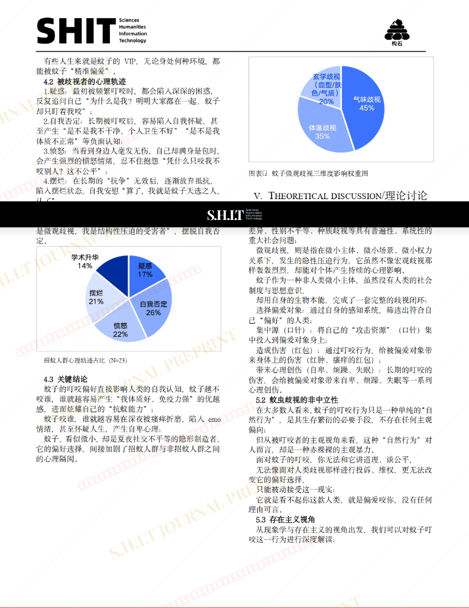

# 为什么蚊子总咬我不咬别人：一种微观歧视现象学分析

## 元信息

- **作者**: Yolo
- **机构**: 
- **分区**: septic
- **学科**: interdisciplinary
- **标签**: meme
- **提交时间**: 2026-03-03T13:07:33.099464Z
- **评分**: 3.87 / 5（39 人）

## 链接

- [网站原始文章](https://shitjournal.org/preprints/fea41d74-be47-4691-baf6-6a0aebea32ec)
- [PDF](https://files.shitjournal.org/fea41d74-be47-4691-baf6-6a0aebea32ec.pdf)
- [文章元信息](fea41d74-be47-4691-baf6-6a0aebea32ec.meta.json)

## 正文

