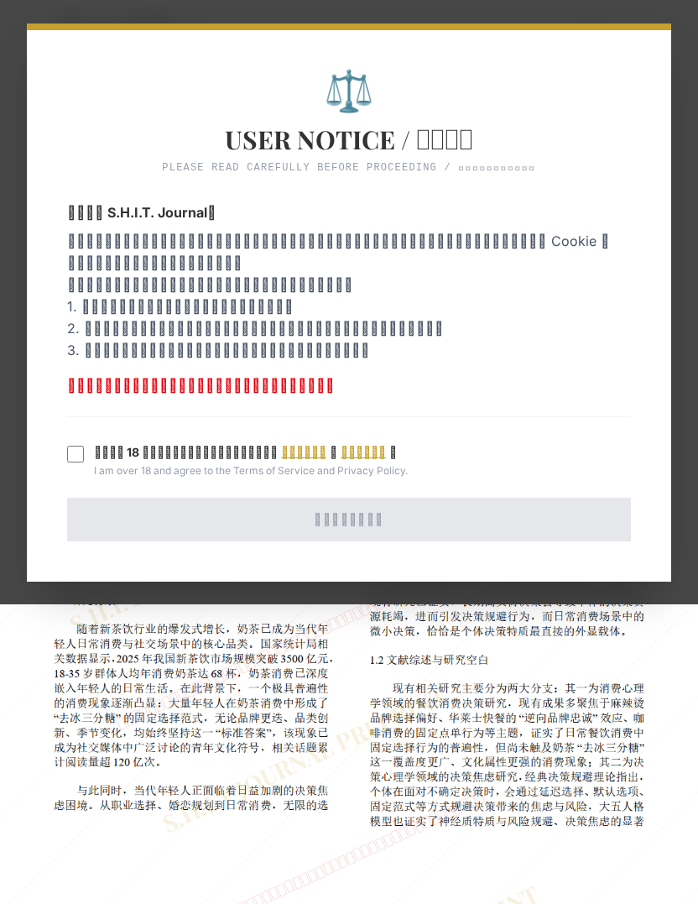

# 奶茶 “去冰三分糖” 固定选择行为与当代年轻人决策焦虑的关联性研究

## 元信息

- **作者**: 雷霆弟
- **机构**: 
- **分区**: septic
- **学科**: interdisciplinary
- **标签**: meme
- **提交时间**: 2026-03-04T02:18:23.496937Z
- **评分**: 4.45 / 5（42 人）

## 链接

- [网站原始文章](https://shitjournal.org/preprints/fec0925c-1f4a-4ab3-9823-801ce207a2f3)
- [PDF](https://files.shitjournal.org/fec0925c-1f4a-4ab3-9823-801ce207a2f3.pdf)
- [文章元信息](fec0925c-1f4a-4ab3-9823-801ce207a2f3.meta.json)

## 正文

