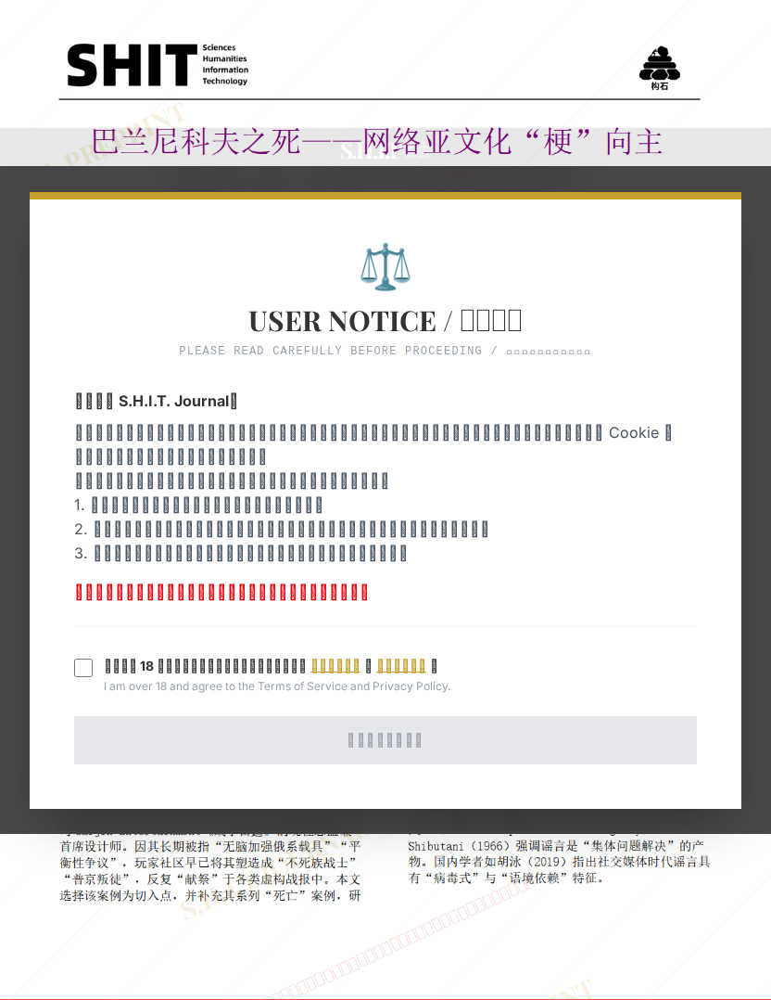

# 巴兰尼科夫之死﹣﹣网络亚文化"梗"向主 流政治谣言转化的传播机制研究

## 元信息

- **作者**: Родители Вячеслава Баранникова
- **机构**: 
- **分区**: septic
- **学科**: law_social
- **标签**: meme
- **提交时间**: 2026-03-04T01:14:05.926808Z
- **评分**: 4.29 / 5（41 人）

## 链接

- [网站原始文章](https://shitjournal.org/preprints/ff226291-a220-4917-90ef-21ce5867a3bc)
- [PDF](https://files.shitjournal.org/ff226291-a220-4917-90ef-21ce5867a3bc.pdf)
- [文章元信息](ff226291-a220-4917-90ef-21ce5867a3bc.meta.json)

## 正文

