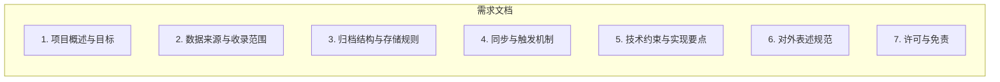

# S.H.I.T Journal 归档项目 — 需求与规格说明

本文档描述本项目的目标、收录范围、归档规则、同步与触发机制、技术约束及对外表述规范，供开发与维护参考。对外简要说明见仓库根目录 `README.md`。

**文档结构**：

---

## 1. 项目概述与目标

**项目名称**：S.H.I.T Journal 归档

**一句话描述**：对 [S.H.I.T Journal](https://shitjournal.org/)（公开社区期刊）进行定期同步与长期归档，将新闻与预印本以结构化形式保存于公开 Git 仓库，便于引用与离线访问。

**目标**：

- **长期保存**：为社区期刊内容提供可追溯的存档副本。
- **学术可引用**：每篇条目含 URL、标题、作者、单位、学科、提交时间等元数据，便于引用与检索。
- **去中心化备份**：公开仓库中的归档不依赖单一站点可用性。

**交付物**：公开 Git 仓库中的 `backup/` 目录，内含 Markdown 正文、JSON 元数据及索引文件。

---

## 2. 数据来源与收录范围

**来源站点**：shitjournal.org（公开社区期刊）。

**收录类型**：

| 类型 | 路径/说明 |
|------|-----------|
| **新闻 / News** | `/news` 下所有条目的详情页（公告、征稿启事、新功能说明、简讯等）。 |
| **预印本 / Preprints** | `/preprints` 下四个分区（旱厕 / Latrine、化粪池 / Septic Tank、构石 / Stone、沉淀区 / Sediment）的全部文章详情页；支持分页遍历与 URL 去重。 |

**不收录**：首页社论、子刊（`/journals`）、投稿（`/submit`）、社区（`/community-guard`）等导航与功能页。

**技术说明**：来源站为 SPA，需在无头浏览器中渲染后解析列表与正文；实现细节见第 5 节。

---

## 3. 归档结构与存储规则

**根目录**：`backup/`。

**按 id 分子目录**（硬性需求）：

- **新闻**：以 slug 为 id，按 slug 的**首字母**分目录。
  - 路径：`backup/news/{slug 首字母}/{slug}.md`、`backup/news/{slug 首字母}/{slug}.meta.json`
  - 示例：`backup/news/m/maintenance.md`、`backup/news/g/governance-10.md`
- **预印本**：以 UUID 为 id，按 UUID 的**前 2 位**（十六进制）分目录。
  - 路径：`backup/preprints/{UUID 前 2 位}/{uuid}.md`、`backup/preprints/{UUID 前 2 位}/{uuid}.meta.json`
  - 示例：`backup/preprints/1f/1fd278a6-7895-4c19-9d4e-5fdbb76904a7.md`

**索引**：`backup/index.json`，记录已收录的新闻与预印本 URL、slug、标题及最近一次同步时间戳；随每次同步合并更新，用于增量同步时跳过已收录条目。

**元数据要求**：

- **新闻**：URL、标题、副标题；正文以 Markdown 存储。
- **预印本**：在新闻基础上增加作者（author）、单位（institution）、学科（discipline）、提交时间（submitted）、粘度（viscosity）等字段（与当前实现中的预印本元数据解析一致）。

---

## 4. 同步与触发机制

**三种触发方式**（需全部支持）：

1. **定时**：每日 UTC 00:00（北京时间 08:00）自动执行一次。
2. **推送触发**：向 `main` 分支 push 时执行一次。
3. **手动**：在 GitHub Actions 中选择 “ShitJournal Archive Sync” → “Run workflow” 可立即执行。

**禁止并行**：同一时间只允许一次同步任务执行；使用 `concurrency` 组（如 `shitjournal-archive`）且不取消进行中的运行（`cancel-in-progress: false`），新触发的运行排队等待。

**增量同步**：已收录的 URL 由 `backup/index.json` 记录；每次同步前加载该索引，仅对尚未收录的新闻与预印本 URL 发起请求并写入，避免重复抓取。同步结束后将本次新增条目与原有索引合并写回 `index.json`。

**增量推送（避免取消后重复）**：在 CI 中可开启 `--push-every N`（如 25），每同步 N 篇预印本（以及新闻完成后）即提交并 push 一次。这样若本次 Action 被取消，已推送的内容会保留在远程，下次 run 会基于最新 index 继续，不会重复下载。

**执行结果**：

- 仅当 `backup/` 有变更时执行提交并 push。
- 提交信息使用统一格式：`chore(archive): sync shitjournal [automated]`。

**可配置项**：预印本单次同步可设上限（如 100 篇）以控制单次运行时间；该上限作用于「本次待同步」的预印本数量。当前 workflow 中为 `--preprints-limit 100`，可按需调整或取消限制。

---

## 5. 技术约束与实现要点

- **运行环境**：GitHub Actions（`ubuntu-latest`）、Python 3.11、Playwright（Chromium）。
- **来源站为 SPA**：需在无头浏览器中渲染后解析列表与详情；列表需支持多 zone（`?zone=latrine|septic|stone|sediment`）及分页（`&page=N`）。
- **输出格式**：正文以 Markdown 存储；元数据以 JSON 存储；文件名与路径须满足「按 id 分目录」规则。
- **礼貌策略**：请求间隔、固定 User-Agent 等，以减轻对来源站压力；具体实现见 `.github/scripts/sync.py`。

---

## 6. 对外表述规范（学术化、去争议化）

**原则**：对外文档（如 README、GitHub Actions 名称与步骤描述、commit 信息）不提及具体抓取或爬虫实现，以「归档」「同步」「收录」「备份」等中性、学术化用语为主。

**推荐用语**：同步、归档、收录、备份、元数据、索引、长期保存、可引用。

**避免用语**：爬虫、抓取、爬取等易引发争议的表述。

**适用范围**：README、workflow 名称与步骤描述、对外说明；内部代码与本文档（`docs/REQUIREMENTS.md`）可保留必要技术术语以便维护。

---

## 7. 许可与免责

- 本归档仅供学术与个人备份之用。
- 内容版权归 S.H.I.T Journal 及原作者所有。
- 若来源站要求停止同步，须立即停止并配合处理。
